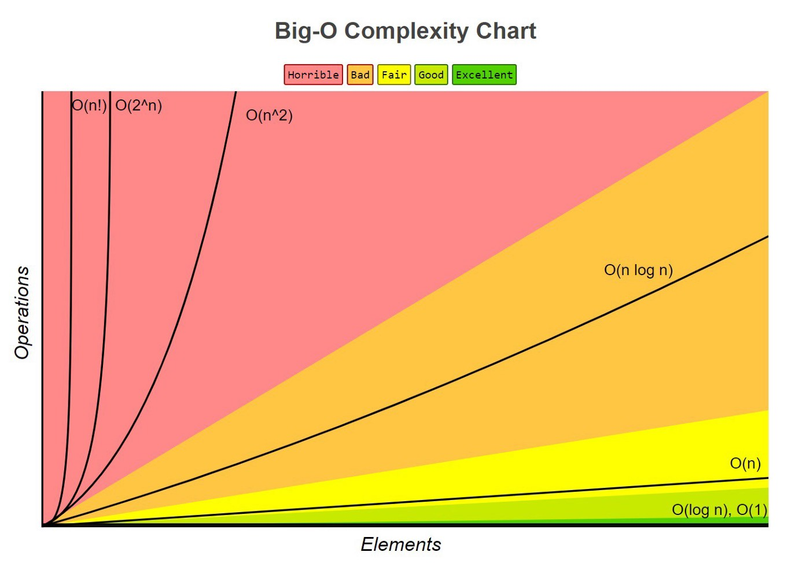

# Beginners Guide to Big O

## What is Big-O?
 * Big-O describes the performance or the complexity of an algorithm.
 * Big-O describes the worst-case scenario of an algorithm.
 * Big-O describes the execution of time and space used by an algorithm.


## Big-O Notation complexity
  1. **O(1)** 
    - Big-O(1) will execute in the same of space and time.
```
        def constant_algo(items):
        result = items[0] * items[0]
        print()
        constant_algo([4, 5, 6, 8])
```
  2. **O(N)**
    - Algorithm performance will grow linearly and in direct proportion.
```
def linear_algo(items):
    for item in items:
        print(item)

linear_algo([4, 5, 6, 8])
```
  3. **O(N<sup>2</sup>)**
   - The complexity of an algorithm is said to be quadratic when the steps required to execute an algorithm are a quadratic function of the number of items in the input.
   - Three nested loops will be **O(N<sup>3</sup>)** ,Four nested loops will be **(N<sup>4</sup>)** and so on.
```
def quadratic_algo(items):
    for item in items:
        for item2 in items:
            print(item, ' ' ,item)

quadratic_algo([4, 5, 6, 8])
```
  4. **O(N<sup>2</sup>)**
   - Discribes an algorithm that growth to the double with each addition to the input.
   - The growth curve will be exponential.
   - Ex: Recursive function
```
    def factorial(x):
        if x == 1:
            return 1
        return x * factorial(x-1)

    print(factorial(5))
```
```
    def fib(n):
        if n == 1:
            return 1
        if n == 0:
            return 0
        return fib(n-1) + fib(n-2)
    # 0 1 1 2 3 5 8
```

```
    def is_even(x):
        if x == 0:
            return True
        else:
            return is_odd(x-1)

    def is_odd(x):
        return not is_even(x)


    print(is_odd(17))
    print(is_even(23))
```

---

## Big-O Complexity Chart


---

# Names and Values in Python

* Python manage the memory dynamicly
* The values exist until there are no more references to them
  ```
    x = 'hello'
    x = 'world'
        'hello' value now has no referring to it so it will be reclaimed
  ```
* Assignment never copies data 
  ```
    nums = [1,2,3]
    other = nums
        nums and other referring to the same list
        if i do nums.append(4) and print other, the output of other will be [1,2,3,4]
  ```
* **'Change'** is un clear 
    - Changing in int: rebinding
      - `x = x +1`
    - Changing in list: mutating
      - `nums.append(7)` : mutating
      - `nums = nums + [7]`: rebinding

* In for loops when we say `for x in nums` each time we iterate we assign to x new data

---

## Sources
[rob-bell](https://rob-bell.net/2009/06/a-beginners-guide-to-big-o-notation)
[stackabuse](https://stackabuse.com/big-o-notation-and-algorithm-analysis-with-python-examples/)
[solo learn](www.sololearn.com)

