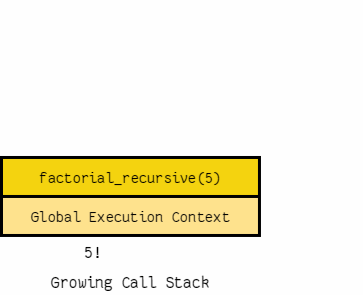

# Pytest fixture and Coverage & Recursive & Classes and objects

## Classes and Objects

### What is Object?
  - Objects are an encapsulation of variables and functions into a single entity.
  - Objects get their variables and functions from classes.

### What is Class?
  - Class is a tempelate for creating objects

```
    To create a class:
        class My_class:
            name = "Nour"
            age = "27"
            def function(self):
                print(f"My name is {self.name} and I'm {self.age} years old.")
```

### How to create an instance from object?

```
    my_object = My_class()
```
### How to Access Object Variables?
```
    print(my_object.name)
    # Output:
        Nour
```
 - We can create multiple different objects form on class and reassign there variables.

    ```
        object_1 = My_class()
        object_1.name = "Mohammed"
        object_1.age = 30
        object_2 = My_class()
        object_2.name = "Abdullah"
        object_1.age = 22
        object_3 = My_class()
        object_3.name = "Ahmed"
        object_3.age = 32
    ```

### How to Access Object Functions?
  - We can access object function by notation similar to variables
```
    my_object.function()
    # Output:
        My name is Nour and I'm 27 years old.
```

### What is __init__() ?
  - `__init__()` is a special function that is called when the class is being initiated, It's used for asigning values in a class.

```
    To create a class:
        class My_class:
            def __init__(self, name, age):
                self.name = name
                self.age = age
            def function(self):
                print(f"My name is {self.name} and I'm {self.age} years old.")
```

  - With `__init__` we can pass the values when we initiating new instance.

```
    obj = My_class("Nour Eddein", 27)
    obj.function()
    # Output:
        My name is Nour Eddein and I'm 27 years old.
```
---

## Thinking Recursively in Python

### Recursive Functions in Python
  - **Recursive function** is a function defined in terms of itself via self-referential expressions. 
  - This mean the function will continuo call itself until met a to return a result.
  - All recursive function share a common structure:
    - Base case.
    - Recursive case.
    - 

### Maintaining State
  - Each recursive call has its own execution context.
  - To maintain state during recursion:
    - Thread the state through each recursive call so that the current state is part of the current call’s execution context.
    - Keep the state in global scope.

---

## Python Testing with pytest: Fixtures and Coverage

### What is Fixtures?
  - Fixtures are objects can be available for all my tests.
  - Those objects might contain data I want to share across tests.
  - To define fixture we can use decorator `@pytest.fixture`
  - If we pass `scope` as a parameter to `@pytest.fixture` it will execute function once and make it available for other tests if needed.

### What is Pytest Coverage?
  - Is a tool for measuring code coverage of Python programs.
  - It monitors the program.
  - noting which parts of the code have been executed, then analyzes the source to identify code that could have been executed but was not.
  - Pytest Coverage used to gauge the effectiveness of tests. 
  - It can show which parts of the code are being exercised by tests, and which are not.

---

### Sources
  1. [Coverage.py](https://coverage.readthedocs.io/en/6.3.2/#:~:text=Coverage.py%20is%20a%20tool,gauge%20the%20effectiveness%20of%20tests.)
  2. [www.learnpython.org](https://www.learnpython.org/en/Classes_and_Objects)
  3. [Ralpython](https://realpython.com/python-thinking-recursively/)
  4. [linuxjournal.com](https://www.linuxjournal.com/content/python-testing-pytest-fixtures-and-coverage)
  5. [pytest.org](https://docs.pytest.org/en/latest/explanation/fixtures.html)

---
## [Go back](./README.md)