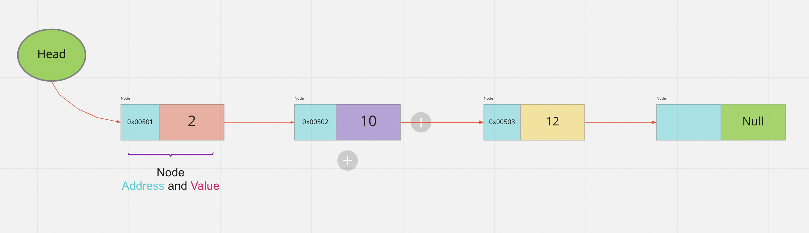
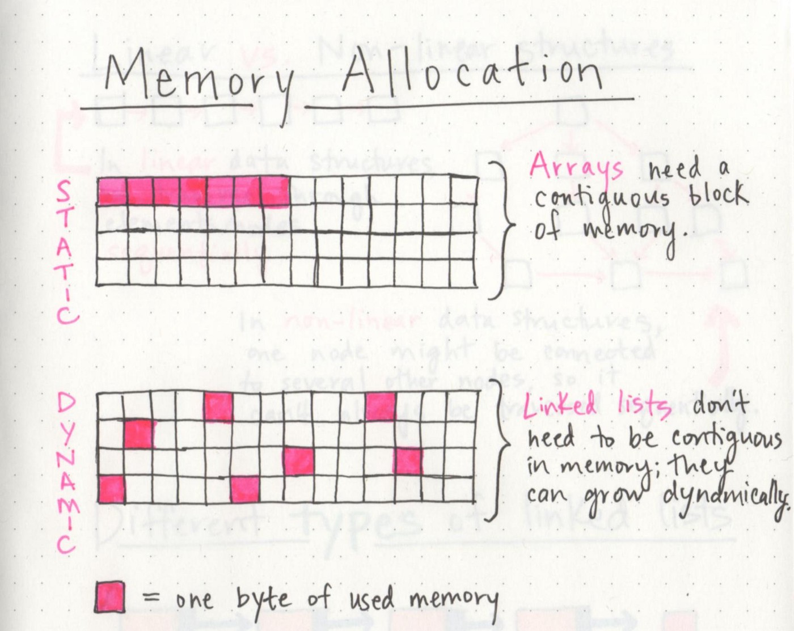

# Linked Lists

## Big-O 

### What is Big-O?
  - Big-O describe the efficiency of an algorithm.
  - Big-O describe the efficiency for the worst case scenario.

### How to evaluate the efficiency ?
  - By the amount of time that function need to complete.
  - By the amount of memory resources a function uses to store data.

### What are the key area that affect the analysis of space and time?
  1. Input size.
  2. Unites of measurement.
  3. Orders of growth.
  4. Best case, worst case, and average case.

### **Input size**:
  - Which mean the size of parameter values are read by the algorithm, that does not mean the number of parameters.
  - > **_Ex_**: If a functions takes an array, the number of elements will directly increase the input size of the parameter.

### **Units of measurement**:
  - **Running Time**:
    1. The time in milliseconds.
    2. The number of operations.
    3. The number of basic operations
  - **Memory Space**:
    1. The amount of space needed to hold the code for the algorithm
    2. The amount of space needed to hold the input data.
    3. The amount of space needed for output data.
    4. The amount of space needed to hold working space during thr calculation.

--- 

## Linked Lists

### What is Linked List?
  - Linked List is a sequence of **Nodes** that are connected/linked to each other.
  - The most defining feature of a Linked List is that each **Node** references to the next **Node**.
  - Linked list is a linear data structure, which mean to reach the last element we have to go through all of the elements.
  
### What is the type of Linked list?
  1. Singly linked list.
  2. Doubly linked list.
  3. Circular linked list.

### **Terminology**
  1. _**Linked list**_ - is a data structure that contains nodes that points to the next node.
  2. _**Singly linked list**_ - That mean each node have only on reference. 
  3. _**Doubly**_ - Mean each node has a double pointer.
  4. _**Node**_ - Mean the individual item that live in the linked list. Each node contain the data for each link.
  5. _**Next**_ - Each node contain the property called **Next** which reference to the next node.
  6. _**Head**_ - The head is reference to the first node.
  7. _**Current**_ - It is like an indicator that indicate to the current **Node** we are looking for.

### What does Linked list Look like?

### How to traverse a linked list?
  - We can't use `foreach` or `for` to traversing linked list.
  - We are depending on the **Next** property in each node to traverse.
  - The best way for traversal is to use `while` loop.
  - The `while` will check the next node, if it null the traversing stop.
  - When we traversing we must have a **Current** variable, because we need something to tell us where exactly in the linked list we are, and well allow us to move.

### How the array and linked list looks like in memory ?

### What is the advantage of linked list ?
  1. Dynamic data structure.
  2. No memory wastage.
  3. Easy to implement.
  4. Insertion and deletion operation are easer.

### what is the disadvantage of linked list?
  1. Memory usage: the node allocate two spaces one for the next address and the other for value
  2. Traversal: is more time consuming, we do not have a direct access like arrays. So, to reach the last element we need to traverse the whole linked list.
  3. Reverse traversing: In singly linked list it is impossible to reverse traversing, but with doubly linked list it possible, because we have a pointer to the previous element, but that wasting memory, because we need extra space for the previous pointer.
  4. Random access: is possible in linked list.