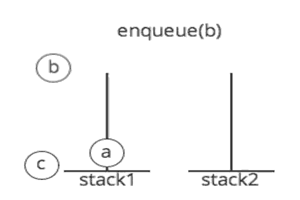

# Stack and Queue Data structure

## Stack 

### What is Stack ?
  - _Stack_ is a data structure that consists of **Nodes**, each **Node** referenced to the next Nodein the stack.
  - Stack is a linear data structure.

### What is Stack Terminology ?
  - **Push**: Nodes or items that are put into the stack are pushed
  - **Pop**: Nodes or items that are removed from the stack are popped. When you attempt to pop an empty stack an exception will be raised.
  - **Top**: Is a pointer to the last item in the stack.
  - **Peek**: When you peek you will view the value of the top Node in the stack. When you attempt to peek an empty stack an exception will be raised.
  - **IsEmpty**: returns true when stack is empty otherwise returns false.

### What is Stack methods ?
  - Push: Add a new node to the top of the stack,
  - Pop: Delete a Node from stack.
  - Peek: is the Node that the top indicate.
  - isEmpty: Check if the stack is empty or Not.

### What is the concepts that Stack follow ?
  - FILO: Which mean **First**  node **In** is the **Last** node **Out**.
  - LIFO: Which mean **Last**  node **In** is the **First** node **Out**.

---
## Queue

### What is a Queue ?
  - _Queue_ is a linear data structure that consist of **Nodes**, each **Node** referenced to the next node.
  - The _Queue_ have two pointers **Front** and **Rear (or Back)**.

### What is Stack Terminology ?

  - __Enqueue__: Nodes or items that are added to the queue.
  - __Dequeue__: Nodes or items that are removed from the queue. If called when the queue is empty an exception will be raised.
  - __Front__: This is the front/first Node of the queue.
  - __Rear__: This is the rear/last Node of the queue.
  - __Peek__: When you peek you will view the value of the front Node in the queue. If called when the queue is empty an exception will be raised.
  - __IsEmpty__: returns true when queue is empty otherwise returns false.

### What is Queue methods ?
  - **Enqueue**: Add a new Node the Queue.
  - **Dequeue**: Delete a node from Queue.
  - **Peek**: Return the value that **Front** pointer indicate.
  - **IsEmpty**: Check the Queue if empty or not.

### What is the concepts that Queue follow ?
  - FIFO: Which mean **First**  node **In** is the **First** node **Out**.
  - LILO: Which mean **Last**  node **In** is the **Last** node **Out**.

---

### The Big(O) of the Queue and Stack are O(1).