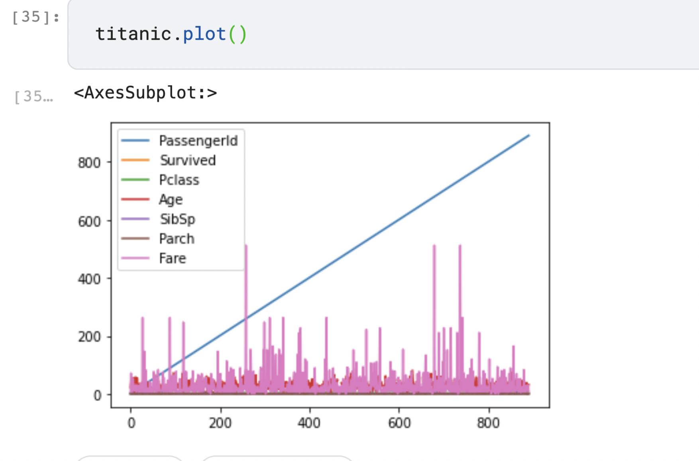
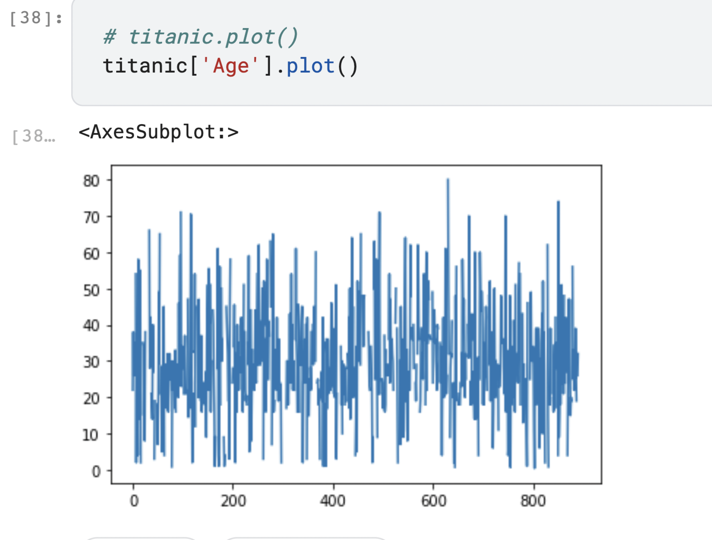
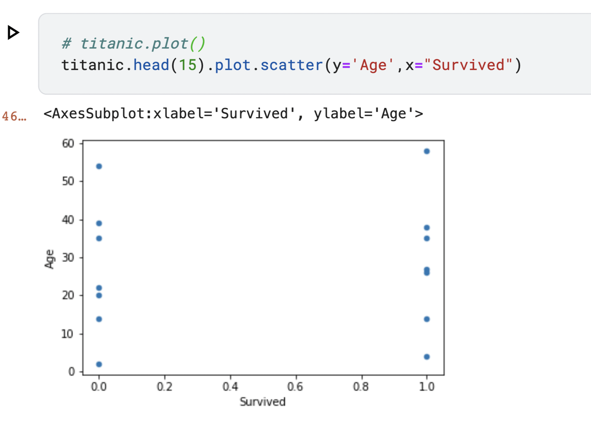

# Pandas

## What is Pandas?
  - **Pandas** is a python library give us a set of tools to do data analysis.
  - With pandas we can load, prepare, manipulate model, and analyze data.

## What methods Pandas has?
  - Pandas has a lot of methods for analysis:
    - Join
    - Merge
    - shape
    - Plot, etc
  - Pandas can take data from different data bases and combine them together.
  - Pandas can read many types of files e.g (CSV, XLS, PARQUET, HTML, HDF5, JSON, SQL, GBQ)
  - Pandas can represent data using plot.


## Pandas methods and examples
  - To import Pandas, the community agreed alias for pandas is **_pd_**.
    - `import pandas as pd`
  - We can create a **DataFrame** of data.
    - Basically, **DataFrame** are a columns and rows like excel sheet.
    - To create a **DataFrame** 
    - Each column in **DataFrame** is **Series**
```
    df = pd.DataFrame(
    {
        "Name": [
            "Braund, Mr. Owen Harris",
            "Allen, Mr. William Henry",
            "Bonnell, Miss. Elizabeth",
        ],
        "Age": [22, 35, 58],
        "Sex": ["male", "male", "female"],
    }
)

    # Output
                           Name  Age     Sex
    0   Braund, Mr. Owen Harris   22    male
    1  Allen, Mr. William Henry   35    male
    2  Bonnell, Miss. Elizabeth   58  female
```
  - We can select a series by `df['Age']`

```
    df['Age']

    # Output
        0    22
        1    35
        2    58
        Name: Age, dtype: int64
```
  - We can create a series from scratch
```
    ages = pd.Series([30, 22, 55], name="Age")

    # Output
        0    30
        1    22
        2    55
        Name: Age, dtype: int64

```
  - We can do some statistics with pandas also, use the describe method to do that and get the count, mean, standard deviation (std), min, max.

```
    df.describe()

    # Output
                    Age
        count	3.000000
        mean	38.333333
        std	    18.230012
        min	    22.000000
        25% 	28.500000
        50%	    35.000000
        75%	    46.500000
        max	    58.000000
```

  - We can read files by use the method of reading e.g `titanic = pd.read_csv("data/titanic.csv")`.
  - To show a specific row use `titanic.head(2)`, this command will display only the row number 2.
  - We can save the file as an excel sheet by using `titanic.to_excel("titanic.xlsx", sheet_name="passengers", index=False)`
  - We can select a data set of DataFrame, Assume I want to see the name and gender of the first 8 titanic passengers row `titanic.head(8)[['Name', 'Age' ]]`
  - Filtering data:
    - > **Notice**: Any condition should be inside a brackets.
    - Assume I'm interested in the passenger older than 35 years. `above_35 = titanic[titanic['Age']>35]`.
    - Assume I’m interested in the titanic passengers from cabin class 2 and 3. `class_23 = titanic[(titanic["Pclass"] == 2) | (titanic["Pclass"] == 3)]`
    - We can select row and column depending on a condition. `adult_names = titanic.loc[titanic["Age"] > 35, "Name"]`, this line of code will show us all passengers name how are older than 35.
    - We can display a specific columns and specific rows by selecting the columns and rows indices, `titanic.iloc[9:25, 2:5]`

# Pandas plot
  - To create plots in Pandas, we need to import a library first. `import matplotlib.pyplot as plt`
  - To see a quick visualization of the data. `titanic.plot()`   
  
    -    

  - Create a plot for a specific column. `titanic['Age'].plot()`   
  
    -    

  - To specify the X and Y axis we use plot scatter method. `titanic.head(15).plot.scatter(y='Age',x="Survived")`   

    - 


--- 
### Resource
   * [pandas.pydata.org](https://pandas.pydata.org/pandas-docs/stable/getting_started/intro_tutorials/04_plotting.html)
   * [Youtube](https://www.youtube.com/watch?v=dcqPhpY7tWk&t=391s)