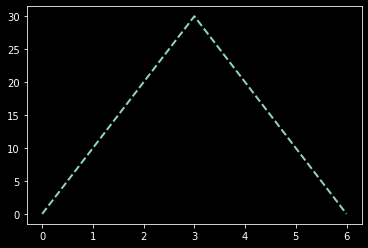
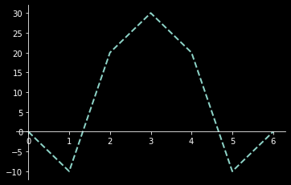
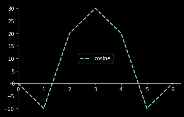

# Matplotlib

## What is Matplotlib?
  - Matplotlib is a library for visualize data in 2D-graphics.


## How to use matplotlib?
  - We need to import matplotlib module to use it.
```
 import matplotlib
```

## What we can do with matplotlib?
  - Simple plot
    - We can draw simple plot using the plot method `plt.plot([0,1,2,3,4,5,6],[0,10,20,30,20,10,0])`
    - Result:
  


## How to customize the plot?
  * Changing colors and line widths:
    * To control the figure size and resolution use the figure method `plt.figure(figsize=(10,6), dpi=80)`
    * To change line width, style, and color use plot method `plt.plot(X, C, color="blue", linewidth=2.5, linestyle="-")`
  
  * To set the limitation of axis us the xlim or ylim methods `plt.xlim(X.min()*1.1, X.max()*1.1)` or `plt.ylim(C.min()*1.1, C.max()*1.1)`
  * To move the axises use the spin method and specify the axis position (left, right, top, bottom) `ax.spines['bottom'].set_position(('data',0))`



  * Adding a legend
    * To specify the line name we can pass an additional argument to the plot method called **label** `plt.plot([0,1,2,3,4,5,6],[0,-10,20,30,20,-10,0],label="cosine")` and `plt.legend(loc='center', frameon=True)`
