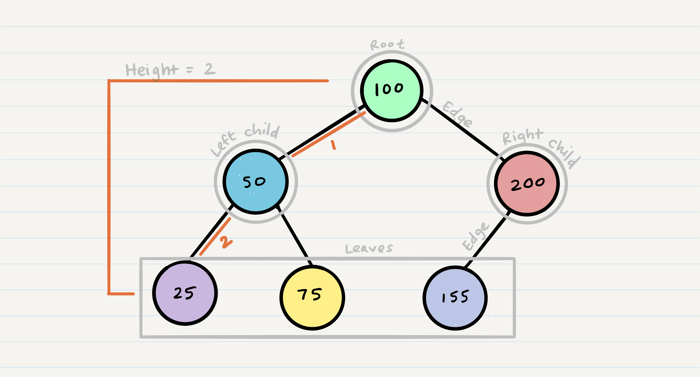
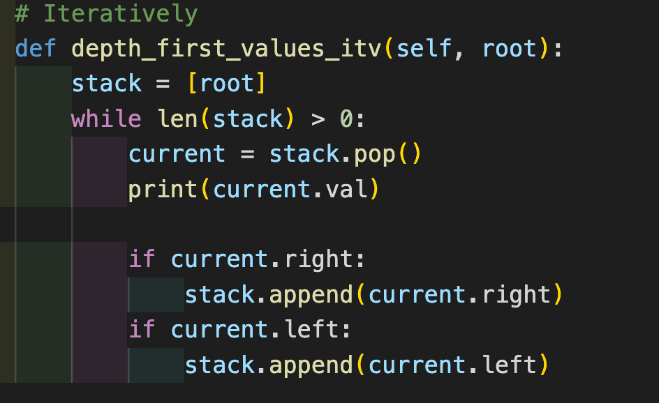
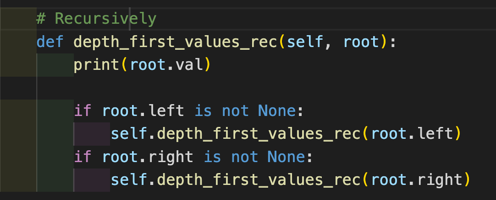
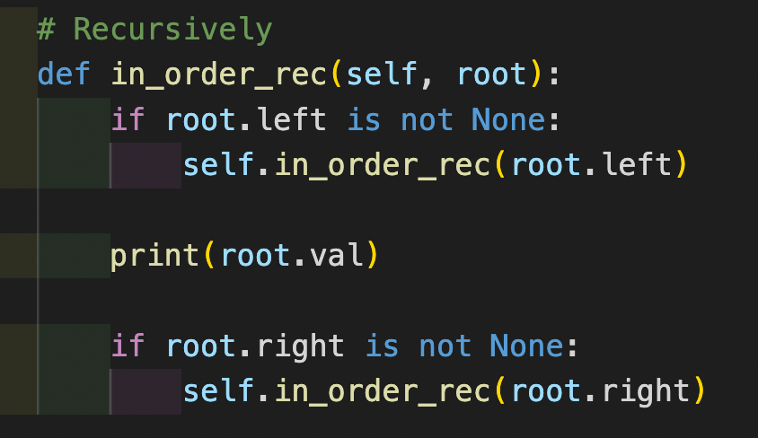
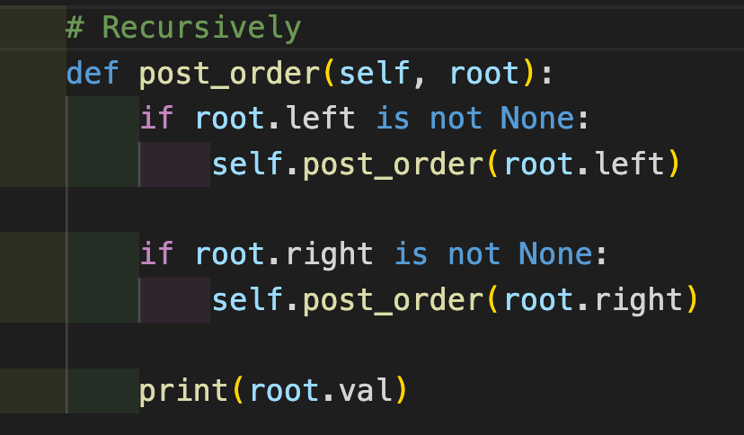

# Tree Data Structure

## What is Tree?
  - The tree data structure is a kind of hierarchal data arranged in a tree-like structure. It consists of a central node, structural nodes, and sub nodes, which are connected via edges.
  - Tree is non-linear data structure.

## What are the tree terminology?
  - **Node**: A Tree node is a component which may contain its own values, and references to other nodes
  - **Root**: The root is the node at the beginning of the tree
  - **K - A**: number that specifies the maximum number of children any node may have in a k-ary tree. In a binary tree, k = 2.
  - **Left**: A reference to one child node, in a binary tree
  - **Right**: A reference to the other child node, in a binary tree
  - **Edge**: The edge in a tree is the link between a parent and child node
  - **Leaf**: A leaf is a node that does not have any children
  - **Height**: The height of a tree is the number of edges from the root to the furthest leaf.

### Look to the sample image

## How to traverse a tree?
  - There are two method to traverse a tree:
    - Depth first
      - Here are three methods for depth first traversal:
        - Pre-order: root >> left >> right =>> A, B, D, E, C, F
        - In-order: left >> root >> right =>> D, B, E, A, F, C
        - Post-order: left >> right >> root =>> D, E, B, F, C, A
    - Breadth First.

## How to implement pre-order method?
  - We can implement pre-order method by two way:
    1. Iteratively
      - 
    2. Recursively 
      - 

## How to implement in-order method?
  - 

## How to implement post-order method?
  - 
