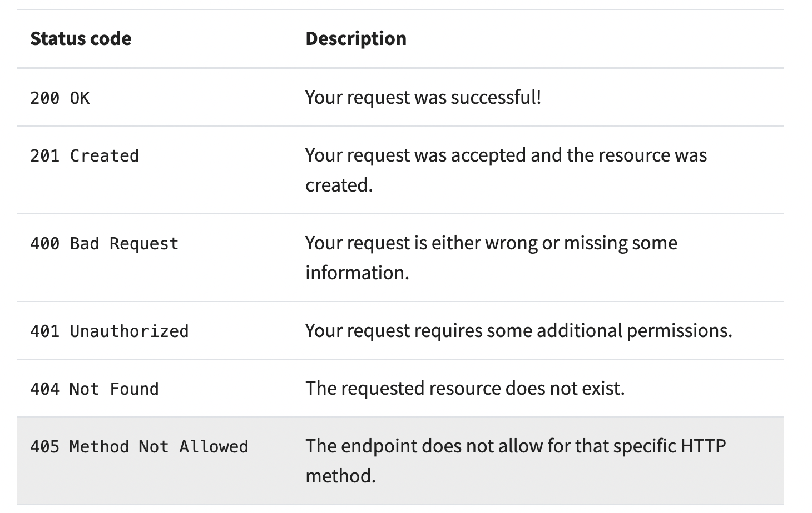

# Serverless

## What is **Serverless**?
  - Serverless is a cloud server executes code on demand.
  - Serverless is a type of micro services.
  - Serverless functions are pieces of code written with backend languages that take an HTTP request and provide a response.

## What is the benefits of serverless?
  - It's a cheap service.
  - Easy of manage
  - We do not need to write code from scratch.
  - Scalable
  - Developers can concentrate more on there business logic.


## Serverless pros and cons

  * ### Pros
    - Serverless offers a number of individual technical and business benefits:
      - Serverless enables development teams to focus on writing code.
      - serverless customers pay for execution only, because the meter starts when the request is made, and ends when execution finishes. 
      - Serverless is a polyglot environment.
      - Serverless simplifies deployment.

  * ### Cons
      - However, there are certain applications for which serverless is not favorable, or which present technical and business trade-offs to consider:
        - Stable or predictable workloads
        - Serverless sometimes start from zero to serve a new request, this latency is not acceptable for certain applications.
        - Serverless functions difficult to monitor with the existing tools.


## What is serverless functions ?
  -  which are pieces of code written with backend languages that take an HTTP request and provide a response.


---

# Python & APIs

## What is API ?
  - API stands for **Application programing interface**.
  - API's is a communication layer, that allow the different systems to talk to each other without having to understand exactly what each other does.
  - Basically, with API we can do a request for data and the server response with the data we need.

## How to use API?
  1. Install requests module using pip `python -m pip install requests`
  2. import the request module
  3. To get the data from the API url use the get method `requests.get(<<URL>>)`
```
    import request
    response = requests.get("https://randomuser.me/api/")
    print (response.text)

    # Output
        '{"results":[{"gender":"female",
        "name":{"title":"Ms","first":"Isobel","last":"Wang"}...'
```

## API methods
  1. get
  2. post
  3. delete
  4. put

## Request and Response
  - All the interactions between the client and the API are split into **Request** and **Response**.
  - **Request**: contain relevant data regarding your API request call.
  - **Response**: contain relevant data returned by the server. 

## Status Codes
  - The status code tell us if the request was successful, missing data, missing credentials, and so on.
  - The following photo shows some status code 

