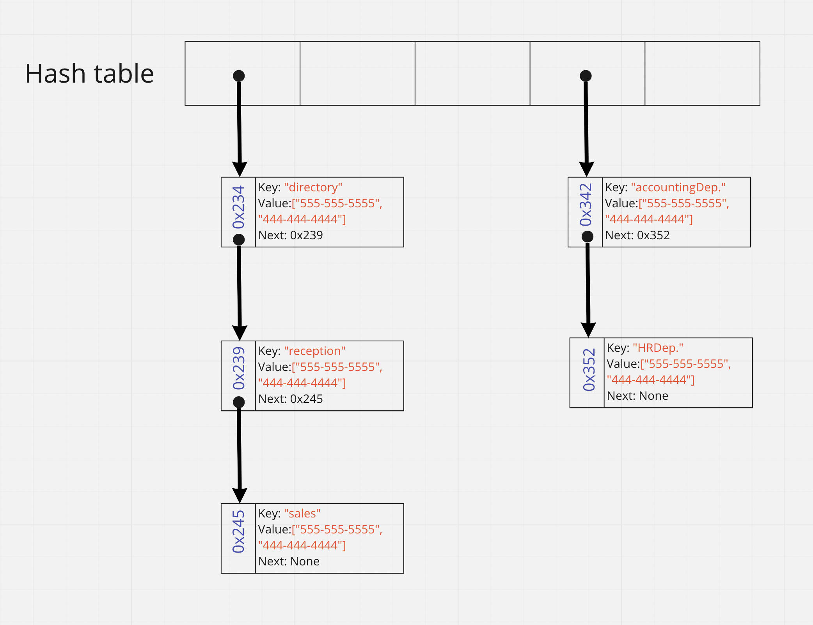

# Hash Table 

## What is a Hashtable?
  - Hashing is a technique or process of mapping keys, values into the hash table by using a hash function. It is done for faster access to elements. The efficiency of mapping depends on the efficiency of the hash function used.
  - Hash tables are a data structure that utilize key value pairs. This means every Node or Bucket has both a key, and a value.

## What is the idea of Hash table?
  - The ability to store key, value pairs and retrieve the data using the key.This can be done with **hash**.
    - **Hash** is the ability to encode the key, to reserve a specific location into the data structure, so we can use this hash to retrieve the value directly.
  - Hash table make retrieving data very fast, because the time complexity will be **O(1)**.

## Hash table terminology:
  - Before we start we should learn hash table terminologies:
    1. **Hash**: A hash is the result of some algorithm taking an incoming string and converting it into a value that could be used for either security or some other purpose. In the case of a hash table, it is used to determine the index of the array.
    2. **Buckets**:A bucket is what is contained in each index of the array of the hash table. Each index is a bucket. An index could potentially contain multiple key/value pairs if a collision occurs.
    3. **Collisions**: A collision is what happens when more than one key gets hashed to the same location of the hash table.

## Hashing Structure

  - ### Hashing
    - As we mentioned, the main job of hashing is turns the key into an integer number, When we do that we should be aware of acouple of things:
      - It’s very important that hash codes are deterministic: their output is determined only by their input.
      - Hash codes should never have randomness.
      - The same key should always produce the same hash code.

  - ### Creating a Hash
    A hashtable traditionally is created from an array.To create a hash table do the following:
    1. Create an array of size 1024 (the size is important for index placement).
    2. Do some sort of logic to turn that “key” into a numeric number value.Here is a possible suggestion:
       1. Add or multiply all the ASCII values together.
       2. Multiply it by a prime number such as 599.
       3. Use modulo to get the remainder of the result, when divided by the total size of the array.
       4. Insert into the array at that index.  

For example:
```
    Key = "Cat"
    Value = "Josie"

    67 + 97 + 116 = 280

    280 * 599 = 69648

    69648 % 1024 = 16

    Key gets placed in index of 16.
```

  - ### Dive into  HOW the key/values are stored in the array.
    - As we said above, the **bucket** refer to the index when we working with hash tables.
    -  Each bucket holds key/value pair combination.
    -  When there is no entry in a specific bucket, the initial value of the bucket will be **NULL**.
    -  The hash table starts each bucket empty and overwrites their value once a key generates a hashCode that corresponds with an index.

 -  ### Collisions
    - **What is _Collision_?**
      - Basically, collision refer to the state where we generate two equaled hash.
    - **What would happen?**
      - If the collision didn't handled, the last hash will overwrite the bucket.
    - **How to handle collision**
      - Collision can be handled by changing the initial state of the buckets.
      - So, instead of starting all the buckets as **NULL** we can initialize a LinkedList in each one.
      - Now, if we generated two equaled hash key, the key/value pairs can be stored as a node in a linked list.
      - So now, the term  **bucket** would be much cleaner.
      - Since different keys can lead to the same bucket it’s important to store the entire key/value pair in the bucket, not just the value.
  
  - ### How are hash maps stored and read?
    - **To store** hash maps do this:
      - accept a key
      - calculate the hash of the key
      - use modulus to convert the hash into an array index
      - store the key with the value by appending both to the end of a linked list
    
    - **To read** hash map do this:
      - accept a key
      - calculate the hash of the key
      - use modulus to convert the hash into an array index
      - use the array index to access the short LinkedList representing a bucket
      - search through the bucket looking for a node with a key/value pair that matches the key you were given.

## Hash table methods
Hash table should have main methods:
  1. **GetHash method**
  2. **Add method**
  3. **Find method**
  4. **Contains method**
  5. **Remove method**

## Code implementation
  - **Step 1**: Create the **Node class**
```python 
    class Node:
        def __init__(self, key, value):
            self.key = key
            self.value = value
            self.next = None
```
  - **Step 2**: Create the **HashTable class**
    - You can change the capacity to satisfies your requirements.
```python
    class HashTable:
        def __init__(self):
            self.capacity = 70
            self.size = 0
            self.buckets = [None] * self.capacity
```
  - **Step 3**: Create the Hash algorithm.
```python
    def get_hash(self, key):
        hash_sum = 0
        # For each character in the key
        for idx, char in enumerate(key):
            # Add (index + length of key) ^ (current char code)
            hash_sum += (idx + len(key)) ** ord(char)
            # Perform modulus to keep hash_sum in range [0, self.capacity - 1]
            hash_sum = hash_sum % self.capacity
        return hash_sum
```
  - **Step 4**: Create the insert method.
```python
    def insert(self, key, value):
        # 1. Increment size
        self.size += 1
        # 2. Compute index of key
        index = self.get_hash(key)
        # Go to the node corresponding to the hash
        node = self.buckets[index]
        # 3. If bucket is empty:
        if node is None:
            # Create node, add it, return
            self.buckets[index] = Node(key, value)
            return
        # 4. Collision! Iterate to the end of the linked list at provided index
        prev = node
        while node is not None:
            prev = node
            node = node.next
        # Add a new node at the end of the list with provided key/value
        prev.next = Node(key, value)
```
  - **Step 5**: Create the find method

```python
    def find(self, key):
        # 1. Compute hash
        index = self.get_hash(key)
        # 2. Go to first node in list at bucket
        node = self.buckets[index]
        # 3. Traverse the linked list at this node
        while node is not None and node.key != key:
            node = node.next
        # 4. Now, node is the requested key/value pair or None
        if node is None:
            # Not found
            return None
        else:
            # Found - return the data value
            return node.value
```
  - **Step 6**: Create remove method.
```python
    def remove(self, key):
        # 1. Compute hash
        index = self.get_hash(key)
        node = self.buckets[index]
        prev = None
        # 2. Iterate to the requested node
        while node is not None and node.key != key:
            prev = node
            node = node.next
        # Now, node is either the requested node or none
        if node is None:
            # 3. Key not found
            return None
        else:
            # 4. The key was found.
            self.size -= 1
            result = node.value
            # Delete this element in linked list
            if prev is None:
                node = None
            else:
                prev.next = prev.next.next
            # Return the deleted language
            return result
```

# Representation of the hash table 



---
### Resources
  - [geeksforgeeks](https://www.geeksforgeeks.org/hashing-data-structure/)
  - [canvas course](https://canvas.instructure.com/courses/4333667/discussion_topics/14075587)
  - [Steve Grice Article](https://pagekeytech.com/blog/dsa/hash-table-python/)
  - [My hash node article](https://explanations.hashnode.dev/hash-tables)