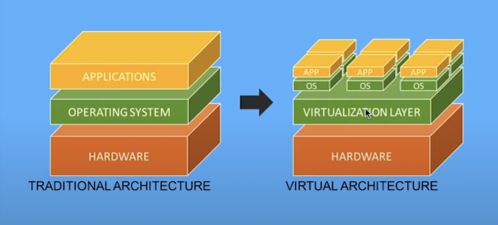

# Django REST Framework & Docker

- # Django REST Framework

## Initial Setup
  - Create a new Django project
  - Inside your project install:
    - `poetry add djangorestframework`
    - `poetry add pygments`
  - Create a new app called snippets
  - Add the new app and the  djangorestframework to the **INSTALLED_APPS** variable into `settings.py`
```python
    # tutorial/settings.py
    INSTALLED_APPS = [
        'django.contrib.admin',
        'django.contrib.auth',
        'django.contrib.contenttypes',
        'django.contrib.sessions',
        'django.contrib.messages',
        'django.contrib.staticfiles',
        'rest_framework', # new
        'snippets', # new
    ]
```

## Models
  - Into the `models.py` create a new model called **Snippet** and add to it the followin code:
```python 
    # snippets/models.py
    from django.db import models
    from pygments.lexers import get_all_lexers
    from pygments.styles import get_all_styles

    LEXERS = [item for item in get_all_lexers() if item[1]]
    LANGUAGE_CHOICES = sorted([(item[1][0], item[0]) for item in LEXERS])
    STYLE_CHOICES = sorted([(item, item) for item in get_all_styles()])


    class Snippet(models.Model):
        created = models.DateTimeField(auto_now_add=True)
        title = models.CharField(max_length=100, blank=True, default='')
        code = models.TextField()
        linenos = models.BooleanField(default=False)
        language = models.CharField(choices=LANGUAGE_CHOICES, default='python', max_length=100)
        style = models.CharField(choices=STYLE_CHOICES, default='friendly', max_length=100)

        class Meta:
            ordering = ['created']

        def __str__(self):
            return self.title
```
  - Then, create an initial migration file and sync the database for the first time.
    - `python manage.py makemigrations snippets`
    - `python manage.py migrate`
  - Now we need to register our model into the `admin.py` to start adding some records.
  - Last step, to add some records we need to create a super-user.
    - `python manage.py createsuperuser`

```python
# snippets/admin.py
from django.contrib import admin
from .models import Snippet

admin.site.register(Snippet)
```
  - Now add some records using the admin page.


## Serialization
  - What is Serialization ?
    - Serialization mean transform model instances into JSON.That's what Django Rest Framework provides for us.
  - ### Now lets see this magic of Django Rest Framework
    - Now create `serializers.py` into the `snippets` folder.
    - Update the file with the following code:

```python
# snippets/serializers
from rest_framework import serializers
from .models import Snippet, LANGUAGE_CHOICES, STYLE_CHOICES


class SnippetSerializer(serializers.ModelSerializer):

    class Meta:
        model = Snippet
        fields = ('id', 'title', 'code', 'linenos',
                  'language', 'style', )
```
  - Now we need a view that handles the logic of combining a model, serializer, and eventually URL together. Hopfuly Django Rest Framework has it's own geniric view.
  - In the `view.py` file add the code below:

```python
# snippets/views.py
from rest_framework import generics
from .models import Snippet
from .serializers import SnippetSerializer

class SnippetList(generics.ListCreateAPIView):
    queryset = Snippet.objects.all()
    serializer_class = SnippetSerializer


class SnippetDetail(generics.RetrieveUpdateDestroyAPIView):
    queryset = Snippet.objects.all()
    serializer_class = SnippetSerializer
```
  - The `ListCreateAPIView` class used to create a read-write endpoint that lists all available Snippet instances.
  - The `RetrieveUpdateDestroyAPIView` used for read-write-delete endpoint for each individual Snippet.

## URLs
  - Now we need to add some configuration to `urls.py` file.
    - In the project-level, update the file with the following code:

```python
# tutorial/urls.py
from django.contrib import admin
from django.urls import include, path # new

urlpatterns = [
    path('admin/', admin.site.urls),
    path('', include('snippets.urls')), # new
]
```
  - Then create a `urls.py` file into the root of the app. and add the following code to it.

```python
from django.urls import path
from rest_framework.urlpatterns import format_suffix_patterns
from snippets import views

urlpatterns = [
    path('snippets/', views.SnippetList.as_view()),
    path('snippets/<int:pk>/', views.SnippetDetail.as_view()),
]

urlpatterns = format_suffix_patterns(urlpatterns)
```

  - **Now we can navigate to `http://127.0.0.1:8000/snippets/.` after we run the server**. VOILA!

---   


# Docker

## What is Docker?
  - Docker is an open source standalone application which works as engine used to run containerized applications. It is installed on your operating system.
  
## What is Docker properties?
  1. Any application running in a container is isolated rom the rest of the system and from other containers.but gives the illusion of running in its own OS instance.
  2. Muliple Docker container can be run on the single operating system simultaneously, you can manage those containers with Docker.
  3. Because Docker applications run into containers we can use them on any system.
  4. Simply we can say Docker is container management system.

## But what is **Container**?
  - Container is a stand unit of software that packages up code and all its dependencies so the application runs quickly and reliably from one computing environment to another.
  - It packages application as images that contain everything needed to run them: code, runtime environment, libraries, and configuration.
  - A Docker container image s a lightweight, standalone, executable package of software that includes everything needed to run an application: code, runtime, system tools, system libraries,and settings.

## What is Virtualization? 
  - Containerization is part of Virtualization.
  - Virtualization is a technology that lets you create useful IT Services using resources that are traditionally bound to hardware.It allows you to use a physical machine's full capacity by distributing its capacities among many users or environments.
   

## how does Virtualization works?
  - Software called **hypervisor** also known as a virtual machine monitor (VMM), separate the physical resources from the virtual environment.
  - **Hypervisor** can sit on top of operating system (desktop, server).
  - **Hypervisors** take the physical resources (Processor, RAM, Hard Disk) and divides them up so that virtual machine environments can use them.
  - Popular Hypervisors:
    - Virtual Box
    - Microsoft hyper-v
    - VMware


---
Resources
  1. [Learn Django](https://learndjango.com/tutorials/official-django-rest-framework-tutorial-beginners)
  2. 