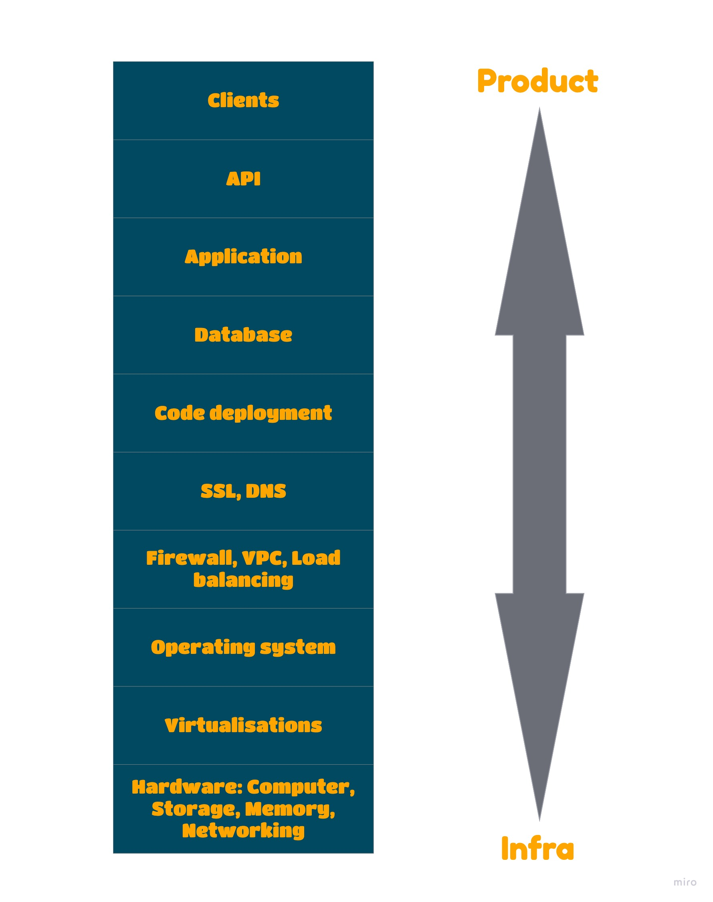
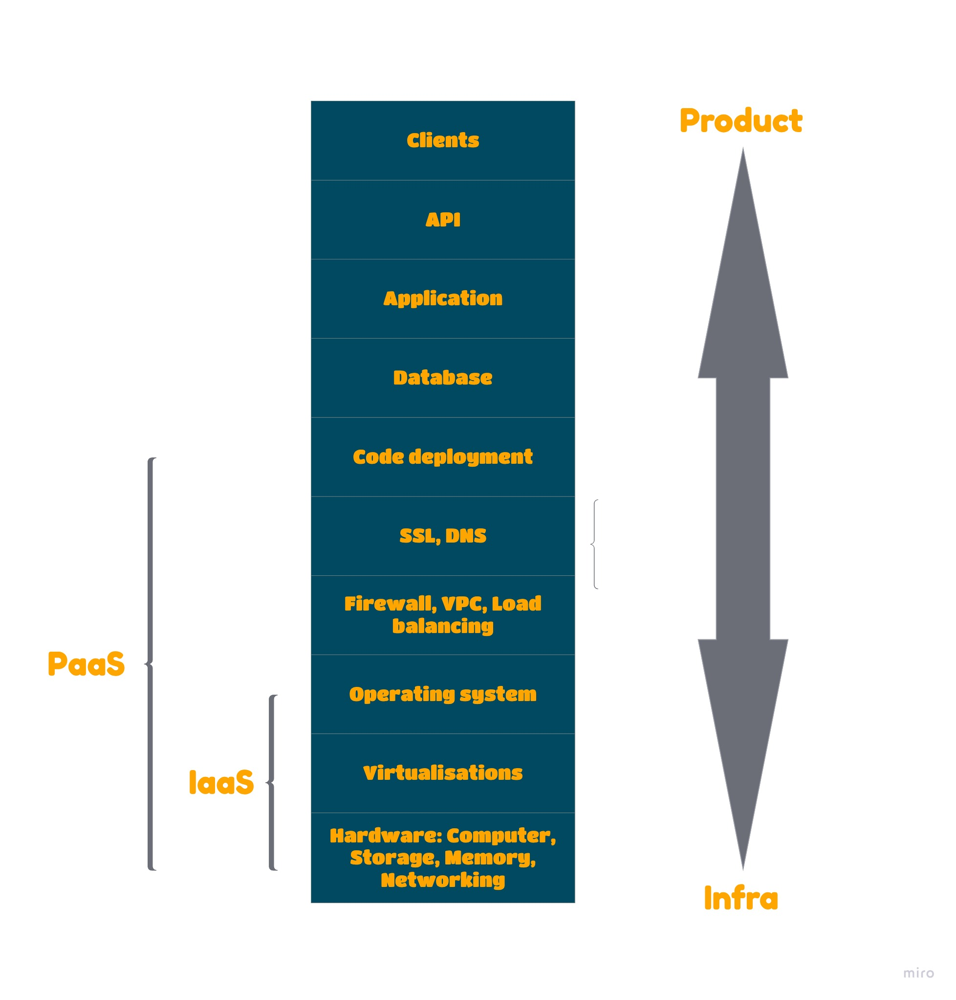
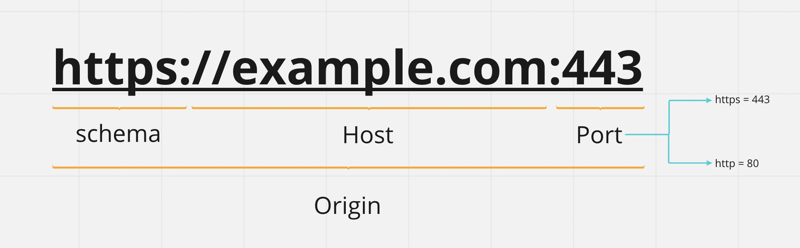
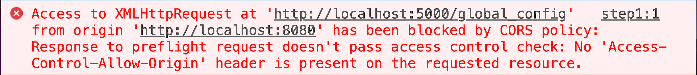

# API Deployment
VCS: Visible Content Store

## Configuring Django Settings: Best Practices

- **Approach 1**: settings_local.py
  - This is the oldest approach. The main idea is to extend the environment-specific settings  in the `settings_local.py` which is ignored by VCS.
  - With this approach we create a `settings_local.py` file and add all the secured configuration to it.
  - And in the `settings.py`, import all the configuration in `setting_local.py`.


| Pros | Cons |
| --- | ---- |
|  Secrets not in VCS. | settings_local.py is not in VCS, so you can lose some of your Django environment settings. |
|   | The Django settings file is a Python code, so settings_local.py can have some non-obvious logic. |
| | You need to have settings_local.example (in VCS) to share the default configurations for developers. |

- **Approach 2**: Separate settings file for each environment
  - This is an extension of the previous approach. It allows you to keep all configurations in VCS and to share default settings between developers.
  - With this approach, we create a settings package with the following structure:

```
settings/
   ├── __init__.py
   ├── base.py
   ├── ci.py
   ├── local.py
   ├── staging.py
   ├── production.py
   └── qa.py
```

  - To run a project with a specific configuration, you need to set an additional parameter when you run the server: `python manage.py runserver --settings=settings.local`

| Pros | Cons |
| --- | ---- |
| All environments are in VCS. | You need to find a way to handle secret passwords and tokens. | |
| It’s easy to share settings between developers. | “Inheritance” of settings can be hard to trace and maintain. |

- **Approach 3**: Environment variables
  - This approach is a bit complicated, but this way solve the issue with the sensitive data.
  - This approach needs to handle the `KeyError`, and convert types manually.
  - Look to the code example bellow:


```python 
    import os

    from django.core.exceptions import ImproperlyConfigured


    def get_env_value(env_variable):
        try:
            return os.environ[env_variable]
        except KeyError:
            error_msg = 'Set the {} environment variable'.format(var_name)
            raise ImproperlyConfigured(error_msg)


    SECRET_KEY = get_env_value('SECRET_KEY')
    DATABASES = {
        'default': {
            'ENGINE': 'django.db.backends.postgresql',
            'NAME': get_env_value('DATABASE_NAME'),
            'HOST': get_env_value('DATABASE_HOST'),
            'PORT': int(get_env_value('DATABASE_PORT')),
        }
    }
```

| Pros | Cons |
| --- | ---- |
| Configuration is separated from code.| You need to handle sharing default config between developers. |
| Environment parity – you have the same code for all environments.|  |
| No inheritance in settings, and cleaner and more consistent code.|  |
| There is a theoretical grounding for using environment variables – 12 Factors.|  |

- **django-environ**
- Writing code using `os.environ` could be tricky sometimes and require additional effort to handle errors. It’s better to use **django-environ** instead.
- Django-environ are merged of:
  1. envparse
  2. honcho
  3. dj-database-url
  4. dj-search-url
  5. dj-config-url
  6. django-cache-url

---

## SSH 

### What is SSH?
- SSH stand for Secure Shell Protocol.
- SSH is a remote administration protocol that allows users to control, access, and modify their remote servers over the internet.
- SSH service replace th unencrypted Telnet.
- SSH uses cryptographic techniques to ensure that all communication to and from the remote server happens in an encrypted manner.

### How Does SSH Work?
To understand the process of SSH follow the example:   
- we can use this command `ssh {user}@{host}` to connect to another device.This command told your device you wan to open a secure connection.
- When you hit enter, you will be prompted to enter the password of the requested account.
- When you start typing nothing will happen in front of you
- But actually it does in the background, when you are typing your system encrypt the password.
- finally, when you hit enter your password will be sent encrypted.


### Different Encryption Techniques
There are three different encryption technologies used by SSH:
  1. Symmetrical encryption
  2. Asymmetrical encryption
  3. Hashing

---

## IaaS vs PaaS vs SaaS

- IaaS, PaaS, and SaaS meanings:
  - **IaaS**: Infrastructure as a Service.
  - **PaaS**: Platform as a Service.
  - **SaaS**: Software as a Service.


- ### SaaS
  - SaaS built to be consumed by the end user.
  - Any web app, mobile application used by the user is a SaaS.
  - The app give the end user a service to do something.
  - For example: Instagram, Facebook, Uber, Slack all of these apps are a SaaS.
  - So, all you need is an internet connection to use these services.
  - These softwares expected to be scalable, secure, and available.

- ### Before the clouds comes up
Now let us talk about how these apps made, the figure below shows the life cycle of the project. To make it easy to understand I will start from the top to bottom, but in reality the project starts from bottom to top.   
   

- Let us describe the figure:
  - You need to have clients, of course to get the clients you need a mobile or web app.
  - The Application will use an API to be consumed and get a data (it could be the back-end).
  - All the complexity will be in the Application layer, this layer makes the app unique.
  - Now we need a storage to store the data.
  - Then to deploy the app we need something to hold the code an take it to production (e.g. repo --> Heroku)
  - Any web app need to secure, so here we need the SSL certificates, and you need a domain for the app.
  - Now we need to secure the incoming requests, and handle the requests load so the firewall and oad balancing comes up.
  - All these should be into a operating system.
  - The operating system could be into a virtual machine.
  - The operating system needs the hardware to be working.

 - So before the the clouds appears, any company wants to build a web app it will do all these steps by themselves.
 - That's a hard work and time consuming.
 - So the companies needs developers that to know in all these fields to build the app.
 - That gives you more customization to your app.
 - So these flexibility mean more manpower, headache, self maintaining, self upgrade, solves all problems by yourself.

- ### IaaS
  - The main idea of IaaS are take the abstract part that all software products shares in, which is (Operating system, Virtualization, and Hardware) and make it as a service.
  - Why? because it's repeated in all software products.
  - So you pay for the service depending on your needs, because you specify the hardware you needs, number of CPU cores, RAM, type of operating system.

- ### PaaS
  - Some companies takes the IaaS to another step, and add to it the (Code deployment, SSL and DNS, firewall, VPS, and load balancing).
  - So this service take care of the security, domain, deployment.
  - So you need to focus on the product itself.


   
---

## CORS and SOP

- Let us talk about the fundamentals and how web apps interact with each other, so to understand that we need to understand the SOP first
  - ### What is SOP?
    - **SOP**: stands for Same-Origin policy, SOP is a rule that is enforced by the browser to control access to data between web applications.
    - Let's take an example, if we have a banking app and a shopping app, by default the interaction between these two applications are limited
    - The bank application is able to make a request to the shopping application such as submitting a form, but the bank application cannot read the response from the shopping app.
    - This mechanism by default implemented into all browsers.
    - **Maybe you are wondering why this policy is built into the browser?**
      - The answer is it's done for security purposes.
      - Let's take an example, imagine you are visiting this shopping app for the first time, and you have no idea that this app is malicious (malicious mean the web app contain a script that automatically make a request to another web app that might have a privet information like the banking application ).
      - So if we don't have the SOP, unfortunately the banking app will respond to the shopping app and give it the information the need.
      - If we don't have a such thing like SOP all the web app will attack each other, and access each other data.

  - But there is a really important distinction that you need to understand with the same-origin policy:
    - SOP does not prevent writing between web application it prevents reading between web applications.
    - Access is determined based on the origin.
  - **But whaot is Origin?**:
    - Origin is defined by the schema (protocol), hostname (domain), and port of the URL used to access it.
   
    - Let's take an example, consider that this `http://example.com/courses` web application making a request to the following URLs:

| URLs | Permitted | Reason |
| --- | --------- | ------- |
|`http://example.com/`| YES | Same schema, domain, and port |
|`http://example.com/courses`| YES | Same schema, domain, and port |
|`https://example.com/sign_in` | NO | Different schema and port|
|`https://a.example.com/sign_in` | NO | Different domain |
|`https://example.com:8080` | NO | Different port |

### The following image will show you the error that you to make a request to different domain.
   


  - ### What is CORS?
    - **CORS**: stands for Cross-Origin Recourse Sharing, CORS is a mechanism that uses HTTP headers to define origins that the browser permits loading resources.
    - But in modern web applications they are need to interact with there subdomains or third-party sites, so in this case we do not need SOP to stop that interaction.
    - Let's take an example, assume you have two domains:
      - www.domain-a.com ==> is a shopping web application
      - www.domain-b.com ==> is a analytics web application
    - domain-a.com has a legitimate use case to access recourses in domain-b.com, So to make that happen domain-b.com should configure CORS rules in it's web application
    - So developers configure CORS rules on the domain-b.com to telling it id there is a specific request from domain-a.com allow that request to go through.


  - HTTP headers is very important to understand the mechanism of CORS
    - HTTP headers uses to define the origins that are allowed to access your site.
    - HTTP headers should be configured in the back-end to be able to communicate with the browser.
  - CORS uses two HTTP headers:
    - Access-Control-Allow-Origin
    - Access-Control-Allow-Credentials

  - ### Access-Control-Allow-Origin
    - **Access-Control-Allow-Origin** identifies to the browser if an origin is permitted to access a specific website.
    - Back to domain-a.com and domain-b.com example, if domain-a.com needs to read data from domain-b.com, so domain-a.com will send a request to the home page of domain-b.com, now if domain-b.com have the CORS rules configured where it says if you get a request from domain-a.com then allow domain-a.com to read the response of the request.
    - **Access-Control-Allow-Origin** syntax :
      - Access-Control-Allow-Origin: * ==> To allow any website in the internet to access the recourses
      - Access-Control-Allow-Origin: `<origin>` ==> Allow single origin to be access the website.
      - Access-Control-Allow-Origin: null
    - It's very important to understand that Access-Control-Allow-Origin headers allows you to access public pages in the applications.  
  
  - ### Access-Control-Allow-Credentials
    - The Access-Control-Allow-Credential response headers allows cookies (or other user credentials) to be include in cross-origin request.
    - Access-Control-Allow-Credentials allowed you to access an authenticated web page.
    - Back to our example assume that domain-a.com want to access authenticated page in domain-b.com let's say account details page which only authenticated users can access, so in order for domain-a.com to be able to access domain-b.com both headers need to be configured in the domain-b.com application, so doamin-b.com  will have:
      - `Access-Control-Allow-Origin: domain-a.com`
      - `Access-Control-Allow-Credentials: true`
---
### Resources
1. [Youtube](https://www.youtube.com/watch?v=GCp5i2v-Mv0)
2. [Django Stars](https://djangostars.com/blog/configuring-django-settings-best-practices/)
2. [Hostinger](https://www.hostinger.com/tutorials/ssh-tutorial-how-does-ssh-work)
3. [Rana Khalil](https://www.youtube.com/watch?v=t5FBwq-kudw)

