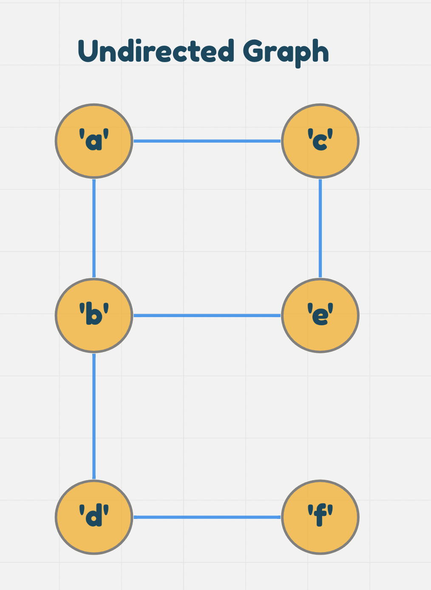
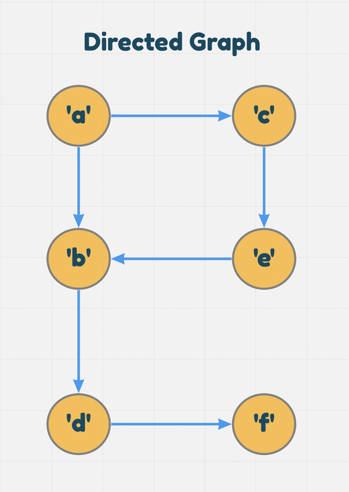
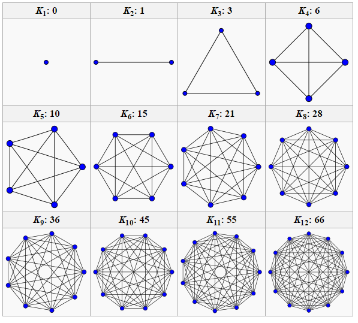
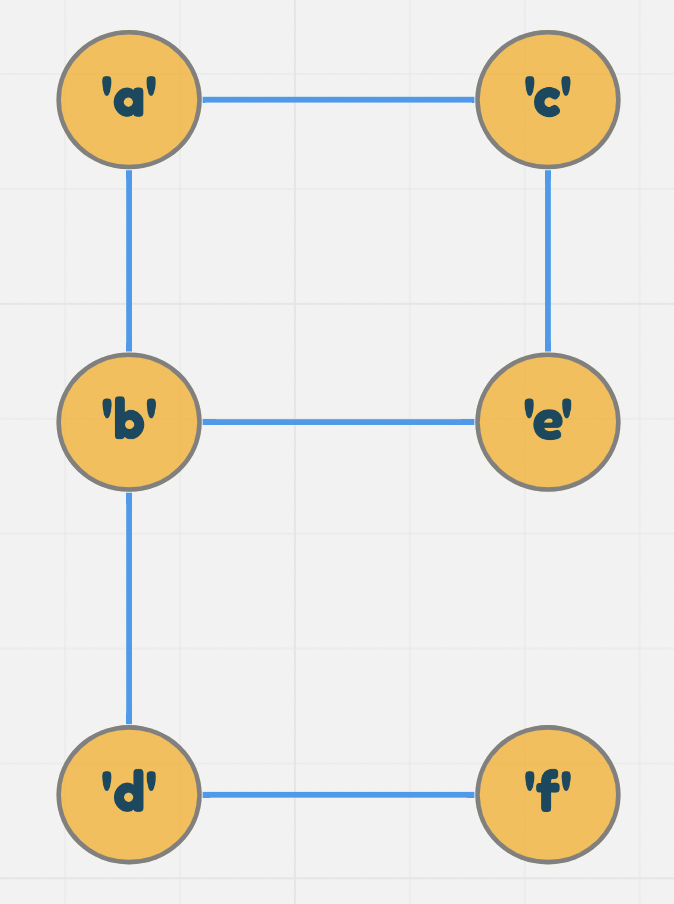
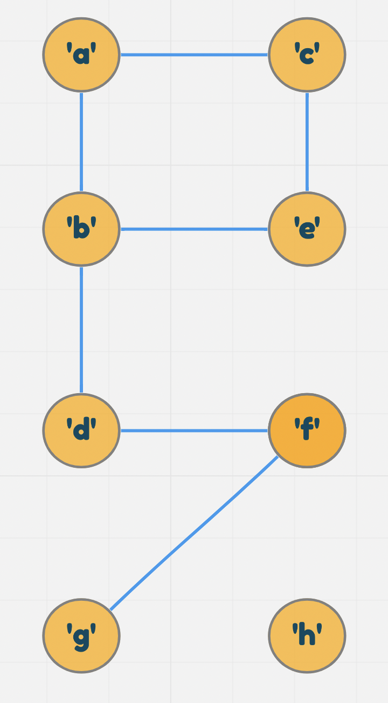

# Graphs data structure

## What is Graph data structure?
- Graph is a non-linear data structure that can be looked at as a collection of **vertices** (or nodes) potentially connected by line segments named **edges**.

## What are Graphs terminologies?
- **Vertices**: vertices also called **Nodes**,vertices is a data object that can have zero or more adjacent vertices.
- **Edge**: an edge is a connection between two vertices.
- **Neighbor**: are all vertices that connected to a specific vertex.
- **Degree**: is the number of edges connected to that vertex.

## How many Graphs directions we have?
- ### **Undirected Graphs**
- ### **Directed Graphs**
- ### **Cyclic Graphs**
- ### **Acyclic Graphs**

### **Undirected Graphs**
- An Undirected Graph is a graph where each edge is undirected or bi-directional. This means that the undirected graph does not move in any direction.

- For example, in the graph below, Node C is connected to Node A and Node E. There are no “directions” given to point to specific vertices. The connection is bi-directional.

   

- The undirected graph we are looking at has 6 vertices and 6 undirected edges.
- Vertices/Nodes = {a,b,c,d,e,f}
- Edges = {(a,c),(a,b),(b,e),(b,d),(c,e),(d,f)}

### **Directed Graphs (Digraph)**
- A Directed Graph also called a Digraph is a graph where every edge is directed.

- Unlike an undirected graph, a Digraph has direction. Each node is directed at another node with a specific requirement of what node should be referenced next.

- Compare the visual below with the undirected graph above. Can you see the difference? The Digraph has arrows pointing to specific nodes.

   

- The directed graph above has six vertices and six directed edges
- Vertices = {a,b,c,d,e,f}
- Edges = {(a,c),(b,d),(b,f),(c,e),(a,b),(e,b)}

## How many Graphs type do we have?
- ### **Complete Graphs**
- ### **Connected Graphs**
- ### **Disconnected Graphs**

### **Complete Graphs**
- Complete graph are the graph that each node of it connected to all other nodes.
- 
   

- ### **Connected Graphs**
- Connected graph is a graph that has all of the nodes at least on edge.

- In the visual above, this looks a lot more than what you are used to seeing. If you look closely at the different vertices of the graph, you will see that each node is connected to at least one other node or vertices. A Tree is a form of a connected graph.

### **Disconnected Graphs**
- A disconnected graph is a graph where some vertices may not have edges.

   

- In the above visual, the disconnected graph shows that some nodes may not always be connected to other nodes or vertices of the graph. It is completely possible to have standalone nodes or edges (also known as islands) in a graph data structure.

## Acyclic vs Cyclic
In addition to undirected and directed graphs, we also have acyclic and cyclic graphs.
### **Acyclic Graph**
- Acyclic Graph is a graph that you can traverse it from specific node but without have the ability to go back fot it, in other words acyclic graph is a directed graph without cycles.

   

### **Cyclic Graphs**
- Cyclic Graphs is a graph that when you start traversing from node a you end up at the same node.

   

## How to represent Graphs?
We have to methods to represent the graph:
- Adjacency Matrix
- Adjacency List

Now let us represent this graph in both ways.
   

### **Adjacency Matrix**
- An Adjacency matrix is represented through a 2-dimensional array. If there are n vertices, then we are looking at an n x n Boolean matrix

- Each Row and column represents each vertex of the data structure. The elements of both the column and the row must add up to 1 if there is an edge that connects the two, or zero if there isn’t a connection.

- This is what an adjacency matrix looks like:
   

- ### A few things to note from the above:

  - Looking at the graph we are representing, you can see that Vertex A connects to both Vertex D and Vertex C. To show this, we place a 1 in the position of (a,c) and (a,d).
  - We follow this same pattern for the other vertex’s and where they are connected.
  - If there is not an edge/connection between the vertex’s, we represent this by placing a 0 in the appropriate point of the matrix.
  - a sparse graph is when there are very few connections. a dense graph is when there are many connections

  - Within an adjacency matrix, an undirected graph will always be symmetric. This is not the case for a directed graph.

- ### **Adjacency List**
- An adjacency list is the most common way to represent graphs.

- An adjacency list is a collection of linked lists or array that lists all of the other vertices that are connected.

- Adjacency lists make it easy to view if one vertices connects to another.

- This is what an Adjacency List looks like:
   

- Looking at the original graph that we are representing, we can see that Vertex A has an edge to both Vertex C and Vertex D. As a result, we will place both Vertex C and Vertex D in the adjacency list. Just from observation, we can see that we will only place the vertices that are connected in the list. If there is no connection between the vertices, they are not listed.

Thinking about how we will implement this in code? Well, let’s look at what the visual is telling us.

We can visually see that we are working with a collection of some sort. The visual is depicting a Linked List, but you could easily make it an array of arrays if you’d like.
Each index or node (depending on the data structure you choose to represent the adjacency list) will be a vertex within the graph.
Every time you add an edge, you will find the appropriate vertices in the data structure and add it to the appropriate location.