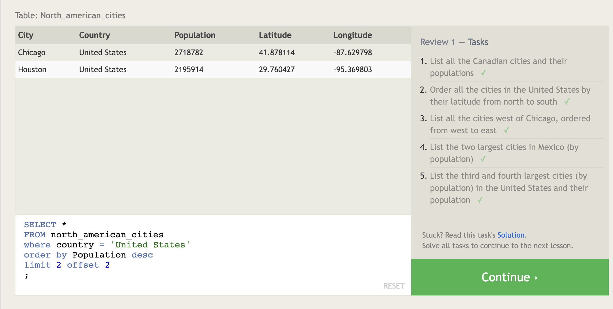

# What is SQl?
  * **SQL** Stands for Structural Query Language, its a language designed to query, manipulate, and transform data from relational database.

# What is Relational database?
  * its represents a collection of related tables.

---

# **SELECT** query
  * ```SELECT column,another_column,... FROM mytable;```: use this command for selecting a specific columns.
  * ```SELECT * FROM mytable;```: use this command to select all columns.
  

# Queries with constraints
  > We use **WHERE** clause for selecting a specific row data.
  * ```SELECT column, another_column, FROM mytable WHERE condition AND/OR another_condition AND/OR …;```: use this query to select a row or multiple rows with a constraints.

  


### Operators used with where clause
| Operator | Condition |
| -------- | --------- |
| =, !=, < <=, >, >= | Standard numerical operators |
| BETWEEN … AND … | Number is within range of two values (inclusive) |
| NOT BETWEEN … AND … | Number is not within range of two values (inclusive) |
| IN (…) | Number exists in a list |
| NOT IN (…) | Number does not exist in a list |
| = | Case sensitive exact string comparison (notice the single equals) |
| != or <> | Case sensitive exact string inequality comparison |
| LIKE | Case insensitive exact string comparison |
| NOT LIKE | Case insensitive exact string inequality comparison |
| % | Used anywhere in a string to match a sequence of zero or more characters (only with LIKE or NOT LIKE) |
| _ | Used anywhere in a string to match a single character (only with LIKE or NOT LIKE) |

  

# Filtering and sorting Query results
  * To select the unique data from the table we use the **DISTINCT** keyword.
  * ```SELECT DISTINCT column, another_column, … FROM mytable WHERE condition(s);``` : use this command to select unique data from the table.

### Ordering results
  * The **ORDER By** keyword used to order the result Ascending or Descending.
  * ```SELECT column, another_column, … FROM mytable WHERE condition(s) ORDER BY column ASC/DESC;```: use this query to select columns and order the results ASC/DESC.
  
### Limiting results to a subset
  * To limit the retrieved results use the **LIMIT** keyword.
  * We can use **OFFSET** keyword to specify where begin counting.
  * ``` SELECT column, another_column, … FROM mytable WHERE condition(s) ORDER BY column ASC/DESC LIMIT num_limit OFFSET num_offset; ```
  
  

# Simple SELECT Queries

  

# Multi-table queries with JOINs

### Wat is Database Normalization?
  * It is a design technique that reduces data redundancy (repetitive) and eliminates undesirable characteristics like Insertion, Update and Deletion Anomalies.

### JOINs Multi-table tables
  * **INNER JOIN**: It is a process to matchs the rows from the first_col with the second_col which have the same key.
``` 
    SELECT column, another_table_column, … FROM mytable
    INNER JOIN another_table 
        ON mytable.id = another_table.id
    WHERE condition(s)
    ORDER BY column, … ASC/DESC
    LIMIT num_limit OFFSET num_offset; 
```
  

# Inserting rows 
  * Inserting new data
``` 
    INSERT INTO mytable 
        (column, another_column, …)
    VALUES (value_or_expr, another_value_or_expr, …),
        (value_or_expr_2, another_value_or_expr_2, …),…;
```
### What is a Schema?
  * **Schema** is where we define the columns that table contains and there datatype for each table.

  

# Updating rows
  * To update a row we must specify exactly which table, columns, and rows to update
```
    UPDATE mytable
    SET column = value_or_expr, 
        other_column = another_value_or_expr, 
    …
    WHERE condition;
```
  
  

# Deleting rows
  * To delete row we must specify exactly which row to delete
```
    DELETE FROM mytable
    WHERE condition;
```

  

# Creating tables

  * When we create a table we should defined its structure by the schema.
```
    CREATE TABLE IF NOT EXISTS mytable (
        column DataType TableConstraint DEFAULT default_value,
        another_column DataType TableConstraint DEFAULT default_value,
        …
    );
```
  * If we create a table and that table is exist, the database will throw an error, to avoid the error we should use **IF NOT EXISTS** clause.
  
  - Table Data types:

| Data type | Description |
| --------- | ----------- |
| INTEGER, BOOLEAN | The integer datatypes can store whole integer values like the count of a number or an age. In some implementations, the boolean value is just represented as an integer value of just 0 or 1. |
| FLOAT, DOUBLE, REAL | The floating point datatypes can store more precise numerical data like measurements or fractional values. Different types can be used depending on the floating point precision required for that value. |
| CHARACTER(num_chars), VARCHAR(num_chars), TEXT | The text based datatypes can store strings and text in all sorts of locales. The distinction between the various types generally amount to underlaying efficiency of the database when working with these columns.  Both the CHARACTER and VARCHAR (variable character) types are specified with the max number of characters that they can store (longer values may be truncated), so can be more efficient to store and query with big tables. |
| DATE, DATETIME | SQL can also store date and time stamps to keep track of time series and event data. They can be tricky to work with especially when manipulating data across timezones. |
| BLOB | 	Finally, SQL can store binary data in blobs right in the database. These values are often opaque to the database, so you usually have to store them with the right metadata to requery them. |

  - Table constraints

| Constraint | Description |
| ---------- | --------
  PRIMARY KEY | This means that the values in this column are unique, and each value can be used to identify a single row in this table. |
| AUTOINCREMENT | For integer values, this means that the value is automatically filled in and incremented with each row insertion. Not supported in all databases. |
| UNIQUE | This means that the values in this column have to be unique, so you can't insert another row with the same value in this column as another row in the table. Differs from the `PRIMARY KEY` in that it doesn't have to be a key for a row in the table. |
| NOT NULL | This means that the inserted value can not be `NULL`. |
| CHECK (expression) | This allows you to run a more complex expression to test whether the values inserted are valid. For example, you can check that values are positive, or greater than a specific size, or start with a certain prefix, etc. |
| FOREIGN KEY | 	This is a consistency check which ensures that each value in this column corresponds to another value in a column in another table.For example, if there are two tables, one listing all Employees by ID, and another listing their payroll information, the `FOREIGN KEY` can ensure that every row in the payroll table corresponds to a valid employee in the master Employee list. |
  


# Altering tables
  * **ALTER TABLE** clause used to add, remove, modify columns and table constraints.
  
### Adding columns
```
    ALTER TABLE mytable
    ADD column DataType OptionalTableConstraint 
    DEFAULT default_value;
```  

### Removing columns

```
    ALTER TABLE mytable
    DROP column_to_be_deleted;
```

### Renaming the table
```
    ALTER TABLE mytable
    RENAME TO new_table_name;
```


# Dropping tables
  * **DROP TABLE** used to remove the entire table including all of its data.
  * ```DROP TABLE IF EXISTS mytable;```
  * Like the **CREATE TABLE** if the table does not exist, and we drop it the data base will throw an error, and to avoid that error we use **IF EXISTS** clause.


---

**Source** [SQLBolt](https://sqlbolt.com/lesson/introduction)

---